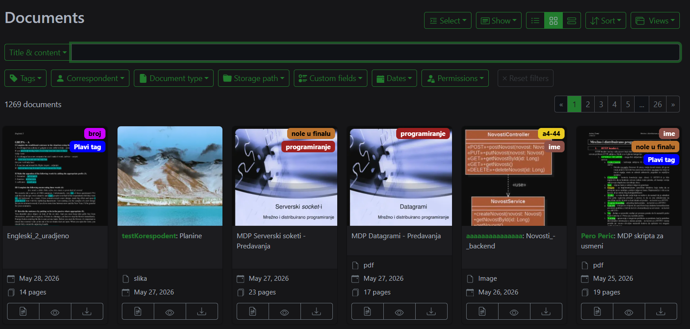
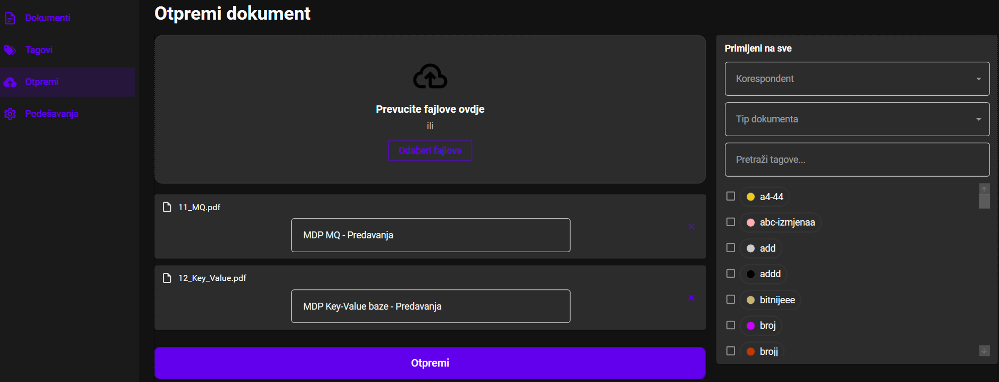
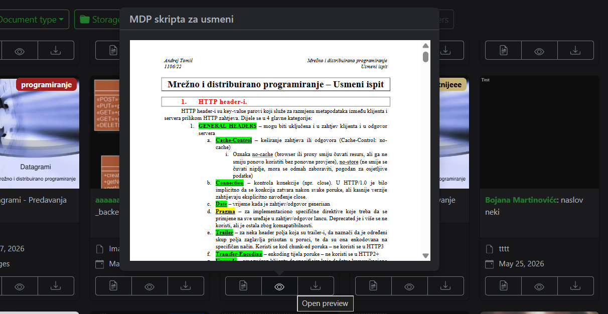
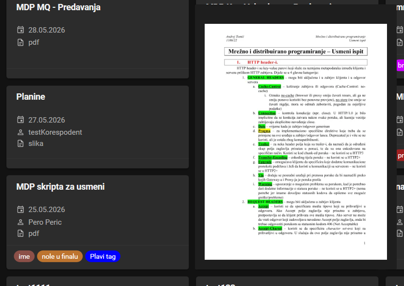

# HCI Analiza – Andrej Tomić

**Predmet:** Human–Computer Interaction (HCI)  
**Projekat:** Desktop klijent za Paperless-NGX  
**Tehnologija:** C# / .NET 8 (WPF)  
**Datum:** 28.05.2026.

---

## 1. Uvod

U ovom dokumentu je predstavljena HCI analiza i opis razvoja savremenog desktop klijenta za upravljanje elektronskim dokumentima u okviru sistema ***Paperless-NGX***. Kako prelazak na digitalne arhive uzima maha, pronalaženje, organizacija i pregled velikih setova podataka postaju svakodnevni izazovi - upravo na te probleme odgovara ova aplikacija, primjenjujući osnovne HCI koncepte.

Fokus razvijenog rješenja nije isključivo na prikazu podataka, već na kreiranju glatkog, prilagodljivog i responzivnog korisničkog iskustva. Kroz napredan grafički prikaz, korisnicima je omogućeno efikasno filtriranje dokumenata (po tagovima, korespondentima i tipovima), brza pretraga i intuitivan pregled sadržaja. Implementirani su i mehanizmi koji smanjuju kognitivno opterećenje, uz jasne vizuelne indikatore i mogućnost prilagođavanja izgleda interfejsa.

Analiza obuhvata pet identifikovanih problema prisutnih u originalnom web interfejsu, njihovo mapiranje na Nielsenove heuristike, te rješenja implementirana u desktop verziji aplikacije. Projekat je realizovan korištenjem C# i .NET 8 (WPF) tehnologija, uz primjenu MVVM arhitekturalnog obrasca koji osigurava jasnu podjelu između korisničkog interfejsa i poslovne logike. Na kraju dokumenta opisana je i dodatna funkcionalnost razvijena sa ciljem daljeg unapređenja efikasnosti i kvaliteta interakcije korisnika sa sistemom.

---

## 2. Identifikovani problemi u web interfejsu

### Problem #1 – Nepostojanje jasnog načina za Upload fajlova

**1. Problem u web interfejsu:**  
Web interfejs Paperless-NGX sistema ne posjeduje jasno izdvojen prostor namijenjen za Upload dokumenata. Upload funkcionalnost je "skrivena" unutar glavnog prikaza dokumenata bez ikakvih "hintova" za novog korisnika gdje se ona nalazi. Jedini način za Upload je Drag&Drop zona, što je za novog korisnika potencijalno nepredvidiv broj koraka.
 

*Slika 1.1 - Screenshot početnog ekrana web interfejsa gdje se traži "Upload" opcija*

**2. Prekršena heuristika:**  
***H6 – Prepoznavanje umjesto pamćenja (Recognition rather than recall)***
Od korisnika se očekuje da sam otkrije ili zapamti način Upload-a, a to bi web interfejs trebao jasno naznačiti, pa da korisnik samo prepozna Upload opciju.

**3. Rješenje u desktop klijentu:**  
U navigacionom meniju sa lijeve strane dodat je poseban tab za Upload koji je jasno vidljiv (čak i za novog korisnika). 

*Slika 1.2 - Screenshot desktop aplikacije sa jasno vidljivim načinom Upload-a*

**4. Objašnjenje:**  
Klikom na pomenuti tab otvara se intuitivan prikaz za Upload i polja za dodavanje metapodataka (u vidu izmjene naslova fajla ili dodavanja tagova, tipa ili korespondenta).
Izdvajanjem Upload-a u poseban tab poštuje se H6 - funkcija je vidljiva i preponatljiva bez potrebe za prisjećanjem. Dodatno se adresira i H1 (Vidljivost statusa sistema), jer korisnik unutar taba dobija povratnu informaciju o toku otpremanja, te H5 (Prevencija grešaka) kroz obavezna polja i validaciju prije slanja.

**5. Mjerenje:**  
Milica: *"Nisam mogla da nađem kako se uploaduje faj na web interfejsu. Na desktop verziji je odmah uočljivo i jednostavno."*
| Scenario | Web verzija | Desktop verzija |
|-----------|--------------|-----------------|
| Upload-ovanje fajla sa računara | Pokušaj okončan neuspješno (preko 40 s traženja uzalud) | 4.32 s |

---

### Problem #2 – Otežan brzi pregled dokumenta (Preview)

**1. Problem u web interfejsu:**  
Otvaranje brzog pregleda u web verziji od korisnika zahtijeva veliku preciznost, jer je neophodno da "pogodi" malu ikonicu oka. Iako je broj potrebnih koraka samo 1, jako je neintuitivno.
 

*Slika 2.1 - Screenshot preview-a na web interfejsu*

**2. Prekršena heuristika:**  
***H7 - Fleksibilnost i efikasnost upotrebe (Flexibility and efficiency of use)***
Po Ficovom zakonu vrijeme potrebno za dolazak do cilja zavisi od veličine cilja, a u ovom slučaju ikonica je veoma mala. Da bi korisnik bio precizan od njega se zahtjeva da uspori kretanje miša što smanjuje efikasnost.

**3. Rješenje u desktop klijentu:**  
Način za dobijanje preview-a je veoma jednostavni hover preko bilo kog dijela kartice. Broj koraka je i dalje 1, ali je sada mnogo brže zbog manje potrebe za preciznošću.

*Slika 2.2 - Screenshot preview-a u desktop aplikaciji*

**4. Objašnjenje:**  
Novo rješenje adresira H7, jer je proširena tolerancija na grešku. Rad za korisnika je dosta brži uz manje precizne pokrete. Takođe podržava i H4 (Konzistentnos i standardi), jer novi OS uglavnom koriste ikonice kao interaktivne elemente.

**5. Mjerenje:**  
Milica: *Puno intuitivnije mi je da se preview otvara samo prelaskom preko kartice, nego da tražim posebnu malu ikonicu oka.*
| Scenario | Web verzija | Desktop verzija |
|-----------|--------------|-----------------|
| Pregled preview-a za 3 različita dokumenta | 6.42 s | 2.11 s |

---

### Problem #3 – [Naziv problema]

**1. Problem u web interfejsu:**  
Objasniti šta nije intuitivno ili efikasno u web interfejsu (npr. previše koraka za određenu akciju, nejasne ikone, preopterećen interfejs...).

***1.1. Screenshot web interfejsa:***  

**2. Prekršena heuristika:**  
Npr. H6 – Prepoznavanje umjesto pamćenja (Recognition rather than recall)  
Objasniti zbog čega je heuristika prekršena.

**3. Rješenje u desktop klijentu:**  
Opisati kako je problem riješen u desktop verziji i priložiti screenshot.  
Navesti koliko su skraćeni koraci ili poboljšano razumijevanje korisničkog toka.

**4. Objašnjenje:**  
Zašto je novo rješenje bolje i kako adresira prepoznatu heuristiku.

**5. Mjerenje:**  
Mini test sa jednom osobom (ili više ako je moguće).  
Popuniti tabelu:

| Scenario | Web verzija | Desktop verzija |
|-----------|--------------|-----------------|
| [opis zadatka] | [vrijeme/koraci] | [vrijeme/koraci] |

---

### Problem #4 – [Naziv problema]

**1. Problem u web interfejsu:**  
Objasniti šta nije intuitivno ili efikasno u web interfejsu (npr. previše koraka za određenu akciju, nejasne ikone, preopterećen interfejs...).

***1.1. Screenshot web interfejsa:***  

**2. Prekršena heuristika:**  
Npr. H6 – Prepoznavanje umjesto pamćenja (Recognition rather than recall)  
Objasniti zbog čega je heuristika prekršena.

**3. Rješenje u desktop klijentu:**  
Opisati kako je problem riješen u desktop verziji i priložiti screenshot.  
Navesti koliko su skraćeni koraci ili poboljšano razumijevanje korisničkog toka.

**4. Objašnjenje:**  
Zašto je novo rješenje bolje i kako adresira prepoznatu heuristiku.

**5. Mjerenje:**  
Mini test sa jednom osobom (ili više ako je moguće).  
Popuniti tabelu:

| Scenario | Web verzija | Desktop verzija |
|-----------|--------------|-----------------|
| [opis zadatka] | [vrijeme/koraci] | [vrijeme/koraci] |

---

### Problem #5 – [Naziv problema]

**1. Problem u web interfejsu:**  
Objasniti šta nije intuitivno ili efikasno u web interfejsu (npr. previše koraka za određenu akciju, nejasne ikone, preopterećen interfejs...).

***1.1. Screenshot web interfejsa:***  

**2. Prekršena heuristika:**  
Npr. H6 – Prepoznavanje umjesto pamćenja (Recognition rather than recall)  
Objasniti zbog čega je heuristika prekršena.

**3. Rješenje u desktop klijentu:**  
Opisati kako je problem riješen u desktop verziji i priložiti screenshot.  
Navesti koliko su skraćeni koraci ili poboljšano razumijevanje korisničkog toka.

**4. Objašnjenje:**  
Zašto je novo rješenje bolje i kako adresira prepoznatu heuristiku.

**5. Mjerenje:**  
Mini test sa jednom osobom (ili više ako je moguće).  
Popuniti tabelu:

| Scenario | Web verzija | Desktop verzija |
|-----------|--------------|-----------------|
| [opis zadatka] | [vrijeme/koraci] | [vrijeme/koraci] |

---

## 3. Dodatna funkcionalnost

Ova sekcija opisuje funkcionalnost koju ste dodatno implementirali radi poboljšanja korisničkog iskustva.

### Naziv funkcionalnosti: Sistem za praćenje promjena u po (Watcher)

### Zašto je ova funkcionalnost potrebna?
Kratko objasniti konkretan problem u postojećem sistemu koji ova funkcionalnost rješava.  
Npr. “Web interfejs ne omogućava pregled trendova uploadovanih dokumenata kroz vrijeme.”

### HCI principi i heuristike:
Navesti koje su Nielsen heuristike adresirane ovom funkcionalnošću (2–3 heuristike) i ukratko objasniti svaku.  
Primjer:  
- **H1 – Vidljivost stanja sistema (Visibility of system status):** Korisnik sada odmah vidi koliko dokumenata pripada kojem tipu.  
- **H7 – Fleksibilnost i efikasnost korištenja:** Napredni korisnici mogu brzo filtrirati klikom na grafikon.

### Implementacija:
Objasniti tehnički pristup i priložiti screenshot.  
Navesti korištene komponente, biblioteke i način interakcije (npr. klik, hover, drag & drop, glasovna komanda).  
Opisati ponašanje sistema i očekivani ishod.

### Testiranje:
Opisati kako je funkcionalnost testirana sa barem jednom osobom.  
U tabeli prikazati rezultate:

| Zadatak | Web verzija | Desktop verzija |
|----------|--------------|-----------------|
| [npr. „Pronađi mjesec sa najviše računa“] | [vrijeme/koraci] | [vrijeme/koraci] |

**Citat korisnika:**  
„[Kratak komentar o korisničkom iskustvu]“

### Tehnički detalji:
Navesti koje su biblioteke, tehnologije i dizajn obrasci korišteni.  
Primjer:  
- LiveCharts2 za vizualizaciju podataka  
- LINQ za agregaciju  
- MVVM arhitektura  
- Lazy loading za poboljšanje performansi

---

## 4. Zaključak

U zaključku ukratko sumirati glavna unapređenja u desktop klijentu u odnosu na web interfejs i opisati kako su predložena rješenja doprinijela boljem korisničkom iskustvu.  
Navedite koje su heuristike najviše kršene u originalnom interfejsu i na koji način su u vašoj implementaciji ispravljene.
